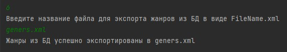

# CrocMyProject

# Вариант проекта
Вариант 21. По заданной тематике сформировать список фильмов для просмотра
Реализовать приложение, формирующее списки фильмов (топ 5, топ 10, топ
100) для просмотра по определенному жанру. Приложение должно
поддерживать добавление оценок к фильмам пользователями. Пользователь
может поставить только одну оценку фильму и впоследствии ее изменить, если
необходимо. Жанры, фильмы, оценки, пользователи должны сохраняться в БД.
Реализовать импорт жанров и фильмов из CSV-файлов. Реализовать механизм
экспорта жанров, фильмов в XML-файл.

# Зависимости в проекте

Для работы с БД:
    
    h2-2.1.214.jar

Для сериализации и десериализации:

    angus-activation-1.0.0.jar

    jackson-annotations-2.13.4.jar

    jackson-core-2.13.4.jar

    jackson-databind-2.13.4.jar

    jakarta.activation-api-2.1.0.jar

    jakarta.xml.bind-api-4.0.0.jar

    jaxb-core-4.0.1.jar

    jaxb-impl-4.0.1.jar

# Запуск программы

1. В файле ConnectionConfig.java поменять путь до БД в переменной URL

2. Запустить сервер - java -cp h2-2.1.214.jar org.h2.tools.Server

Логин: admin

Пароль: admin

3. Запуск производить в IDEA

4. Запускать файл Main - содержит в себе меню для взаимодействия с БД

5. После запуска ввести имя пользователя из БД
Текущий список пользователей в БД:
    - Gena123
    - Oleg555
    - User1
    - User2
    - User3
    - User4
    - User5
    - User6
    - User7
    - User8
    - Vovan226

6. Использовать пункты меню

# Функционал и скриншоты
Список действий в Main.java
    
0 - Выход из программы

1 - Получить список топа фильмов по жанру

2 - Оценить фильм по его названию

Список фильмов для удобства (в программе можно получить командой 9):
Безумные Парни на Безумных Машинах
Гонка за Сокровищами
Зловещий маяк
Инопланетная угроза
Исчезновение ювелира
Магия Добра
Секреты прошлого
Таинственный Остров в океане
Лень придумывать название
Детективный детектив
Фантастично
Хехе
Хаха
Хихи
Ааааааа
Абоба
Мел
TestNewMovie1
TestNewMovie2
TestNewMovie3
TestNewMovie4
TestNewMovie5
TestNewMovie77
TestNewMovie11
TestNewMovie12

3 - Обновить оценку фильму

4 - Импорт новых жанров из csv файла

5 - Импорт новых фильмов из csv файла

6 - Экспорт жанров из БД в xml файл

7 - Экспорт фильмов из БД в xml файл

8 - Получить список рейтинга фильмов и их оценок от пользователей

9 - Получить список фильмов и их жанров

# Структура классов и пакетов

ConnectionConfig - Путь до места хранения БД, логином и паролем БД, а также путями хранения CSV и XML файлов для удобства

Main - Основной файл с меню пользователя

CsvFiles - Папка, в которой должны храниться CSV файлы для импорта    

XmlFiles - Папка, в которую сохраняются XML файлы

Genre - Жанры:
    
    - Genre - Plain Old Java Object

    - GenreDao - Data Access Object

    - GenreImpoerter - Импорт жанров в БД из CSV файла
    
    - GenreExporter - Экспорт жанров из БД в XML файл

    - GenresListWrapper - XML обертка для жанров

Movie - Фильмы:
    
    - Movie - Plain Old Java Object

    - MovieDao - Data Access Object

    - MovieImpoerter - Импорт фильмов в БД

    - MovieImpoerter - Импорт фильмов в БД из CSV файла
    
    - MovieExporter - Экспорт фильмов из БД в XML файл

    - MovieListWrapper - XML обертка для фильмов

Rating - Рейтинг:
    
    - Rating - Plain Old Java Object

    - RatingDao - Data Access Object

Users - Пользователи:
    
    - Users - Plain Old Java Object
   
    - UsersDao - Data Access Object

